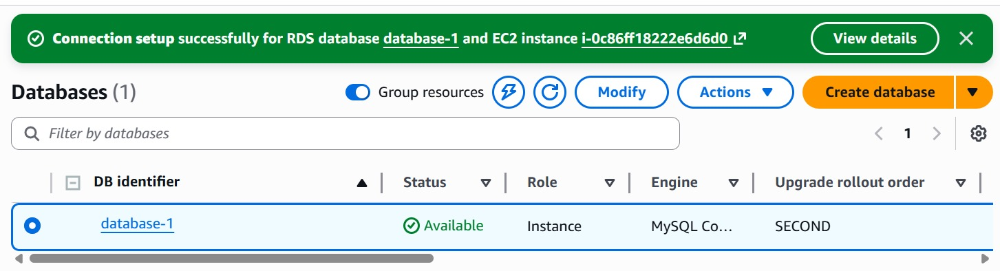
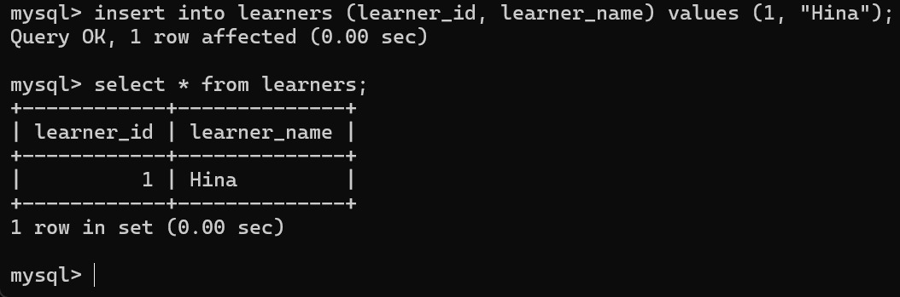
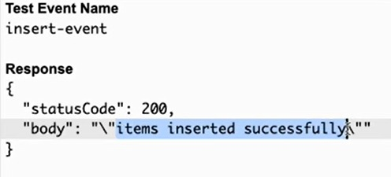
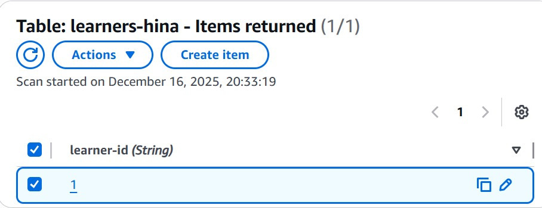
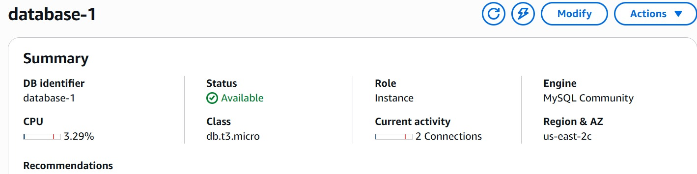
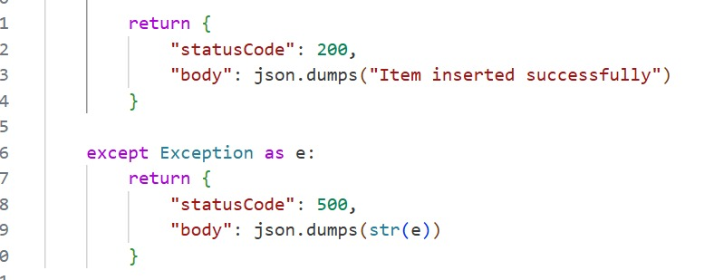

📌 Project Overview

This project demonstrates a serverless data management architecture using AWS services.
It integrates relational and NoSQL databases with AWS Lambda for scalable, event-driven data operations.

🛠️ AWS Services Used

AWS RDS (Relational Database Service)

AWS DynamoDB

AWS Lambda

AWS IAM

🏗️ Architecture

The system uses AWS Lambda to interact with:

RDS for structured relational data

DynamoDB for fast NoSQL operations

This design enables scalable data processing without managing servers.

⚙️ Implementation Steps

Created an RDS instance with a managed database engine

Created a DynamoDB table with a primary key

Configured an IAM role with permissions for Lambda to access RDS and DynamoDB

Created an AWS Lambda function to:

Insert data

Fetch data

Interact with both RDS and DynamoDB

Tested Lambda functions using the AWS Management Console

📸 Screenshots

Screenshots of the AWS resources and Lambda execution results are included in the repository for validation and demonstration.

## 📸 Screenshots

### RDS Connection Success

### MySQL Query Validation (RDS)

### Lambda Test Response

### DynamoDB Table Items

### RDS Metrics Summary

### Lambda Code Logic

📈 Learning Outcome

Understanding of serverless architecture

Hands-on experience with AWS relational and NoSQL databases

Lambda integration with multiple data sources

IAM role and permission management

🚀 Future Improvements

API Gateway integration for RESTful endpoints

Infrastructure as Code (IaC) using Terraform

CI/CD automation for deployment
